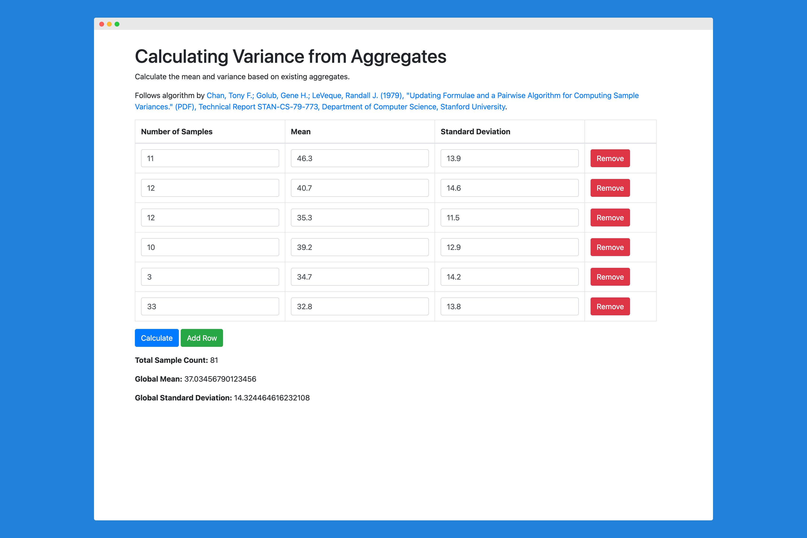

# pairwise-sample-variance

Pairwise Algorithm for Computing Sample Variances

Given a set of samples, x_1, x_2, ..., x_n with aggregate statistics about each sample, say the mean and variance, calculate the mean and variance of all samples combined.

Created as a proof of concept to help calculate aggregate statistics in meta studies.

